# Module 4 - Styling Layers

**Author**: Ketty, Ben Hur

## Pedagogical Introduction

This module is designed to teach you how to change the visual appearance of a map by selecting appropriate symbols, map colors and apply appropriate effects. At the end of the module, you should know concepts like map symbology and map styles. In addition, you’ll learn  the following skills;

*   styling layers 
*   basic raster and vector symbology and how to apply them to a layer 
*   blending modes and draw effects 
*   using expressions to run a spatial operation

## Required tools and resources

*   Working computer
*   Internet connection
*   QGIS 3.16 or later
*   Rajshahi administrative boundary layer (inside [module4.gpkg](data/module4.gpkg))
*   Rajshahi clinics (inside [module4.gpkg](data/module4.gpkg))
*   [BGD_Rajshahi High Resolution Settlement Layer](data/HRSL_BGD_Rajshahi_Population.tif)

## Prerequisites

*   Basic knowledge of operating a computer
*   Fair understanding of all previous modules

## Additional resources

*   QGIS Symbology - [https://docs.qgis.org/3.16/en/docs/training_manual/basic_map/symbology.html](https://docs.qgis.org/3.16/en/docs/training_manual/basic_map/symbology.html)
*   Style Sharing Repository - [https://www.gislounge.com/qgis-style-sharing-repository/](https://www.gislounge.com/qgis-style-sharing-repository/)
*   Styles - [https://plugins.qgis.org/styles/](https://plugins.qgis.org/styles/)
*   Style Hub - [https://style-hub.github.io/](https://style-hub.github.io/)
*   Hillshade in QGIS -[https://bnhr.xyz/2019/02/08/mapping-icebergs-in-qgis.html](https://bnhr.xyz/2019/02/08/mapping-icebergs-in-qgis.html)
*   Mapping Icebergs in QGIS - [https://bnhr.xyz/2019/02/08/mapping-icebergs-in-qgis.html](https://bnhr.xyz/2019/02/08/mapping-icebergs-in-qgis.html)

## Thematic introduction

Let’s start with an example: 

Let’s imagine you’re in a new city, perhaps as a tourist, for leisure or for business. The city has a range of must see/visit places which include museums, cafes, beach fronts, monuments, cultural shops and markets. You are then handed a paper city map which shows you the point locations of all the must see places in that city. The tourist points are all marked as red dots. In your view, would this map ease your tour of the new city? I wouldn’t expect it to.

That’s why it’s always important to make a “Map showing different symbols and colors”. What you see in your map after applying styling concepts is a dynamic visual representation of the data you’re working with.

### Important Panels, Tabs and Render types

#### **Layer Styling Panel** 

This panel is somehow a shortcut to some of the features of the layer properties dialog. It indeed offers you a quick and handy way to define the rendering and the behavior of a layer, and to visualize its effects without opening the layer properties dialog.

Besides avoiding you dealing with the modal and blocking dialog of the layer properties, it also avoids you cluttering the screen with features dialogs given that it embeds most of them (color selector, effects properties, rule edit, label substitution...): e.g., clicking color buttons inside the layer style panel causes the color selector dialog to be opened inside the layer style panel itself rather than as a separate dialog.

From a drop-down list of current layers in the layer panel, select an item and:

*   set its symbology, transparency, and histogram in the case of a raster layer. These options are the same available in Raster Properties Dialog ([https://docs.qgis.org/3.16/en/docs/user_manual/working_with_raster/raster_properties.html#raster-properties-dialog](https://docs.qgis.org/3.16/en/docs/user_manual/working_with_raster/raster_properties.html#raster-properties-dialog)). 
    * Access the Raster Properties Dialogue by Double Clicking the Raster Layer->General 
*   set its symbology, and labels. These options are the same available in The Vector Properties Dialog ([https://docs.qgis.org/3.16/en/docs/user_manual/working_with_vector/vector_properties.html#vector-properties-dialog](https://docs.qgis.org/3.16/en/docs/user_manual/working_with_vector/vector_properties.html#vector-properties-dialog)). 
    * Access the Vector Properties Dialogue by Double Clicking the Vector Layer->General 
*   follow the whole history of changes you applied to the layer style in the current project; you can therefore cancel or restore to any state by selecting it in the list and Click Apply.

Another powerful feature of this panel is the Live update checkbox. Tick it and your changes are automatically rendered in the map canvas as you go on. You no longer need to Click the Apply button.

To activate the panel, Click View->Panels, then tick Layer styling.

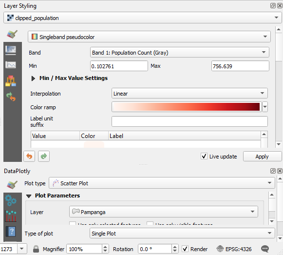

Figure 4.1: Layer Styling Panel

#### **Symbology Tab in the Layers Properties**

To access the Symbology Tab, Double Click the Layer to Open the Layer Properties-> Click Symbology

Here, you can specify the band rendering settings like, the render type, band, mix/max values, color rendering and resampling. In the screenshots below, you can see the symbology tabs for vector and raster datasets, respectively;

Figure 4.2: Symbology tab for vector and raster data, respectively

#### **Raster rendering: Band rendering**

QGIS offers four different Render types. The choice of renderer depends on the data type. The default render type is Single band grey color. You’ll have to change it to the appropriate type based on the data type. 

*   Multiband color ([https://docs.qgis.org/3.16/en/docs/user_manual/working_with_raster/raster_properties.html#multiband-color](https://docs.qgis.org/3.16/en/docs/user_manual/working_with_raster/raster_properties.html#multiband-color)) - if the file comes with several bands (e.g. a satellite image with several bands).
*   Paletted/Unique values ([https://docs.qgis.org/3.16/en/docs/user_manual/working_with_raster/raster_properties.html#paletted]()) - for single band files that come with an indexed palette (e.g. a digital topographic map) or for general use of palettes for rendering raster layers.
*   Singleband gray ([https://docs.qgis.org/3.16/en/docs/user_manual/working_with_raster/raster_properties.html#singleband-gray](https://docs.qgis.org/3.16/en/docs/user_manual/working_with_raster/raster_properties.html#singleband-gray)) - (one band of) the image will be rendered as gray. QGIS will choose this renderer if the file is neither multiband nor paletted (e.g. a shaded relief map).
*   Singleband pseudocolor ([https://docs.qgis.org/3.16/en/docs/user_manual/working_with_raster/raster_properties.html#label-colormaptab](https://docs.qgis.org/3.16/en/docs/user_manual/working_with_raster/raster_properties.html#label-colormaptab)) - this renderer can be used for files with a continuous palette or color map (e.g. an elevation map).
*   Hillshade ([(https://docs.qgis.org/3.16/en/docs/user_manual/working_with_raster/raster_properties.html#hillshade-renderer](https://docs.qgis.org/3.16/en/docs/user_manual/working_with_raster/raster_properties.html#hillshade-renderer)) - Creates hillshade from a band.

#### **Vector rendering**

When you load spatial data layers into QGIS Desktop, they are styled with a random Single Symbol rendering. To change this click on Layer->Properties->Style.

There are several rendering choices available from the menu in the upper left corner:

*   Single Symbol – this is the default rendering in which one symbol is applied to all the features in a layer.
*   Categorized – allows you to choose a categorical attribute field to style the layer with. Choose the field, and click Classify and QGIS will apply a different symbol to each unique value in the field. You can also use the Set column expression button to enhance the styling with a SQL expression.
*   Graduated – allows you to classify the data by a numeric field attribute into discrete categories. You can specify the parameters of the classification (classification type and number of classes) and can use the Set column expression button to enhance the styling with a SQL expression.
*   Rule-based – use this to create custom rule based styling. Rules will be based on SQL expressions.
*   Point displacement – if you have a point layer with stacked points, this option can be used to displace the points so they are all visible.
*   Inverted polygons – this is a new renderer that allows a feature polygon to be converted into a mask. For example, a city boundary polygon used with this renderer would become a mask around the city. It also allows for use of Categorized, Graduated and Rule-based renderers and SQL expressions.

## Main content 

### Phase 1: Basic raster and vector symbology

Vector data symbology may vary by transparency, color, rotation, and size.  

#### **Content**

*   Layer properties and symbology menu
*   Types of vector rendering
*   Types of raster rendering (band rendering)

#### **Example 1: Vector rendering**

1. To demonstrate this example, we’ll use two example datasets; 1. [Clinics](https://drive.google.com/file/d/1iJQ1nP0ulA96OhyT9wakRheahYKnNmjc/view?usp=sharing) and 2. [Administrative boundary](https://drive.google.com/file/d/1GiFmr4As5e-yn-4lCqotAzUBHzXU1NS_/view?usp=sharing) of Rajshahi division 
2. Add the two vector layers into qgis; Click the Add vector layer button 
 or use the browser panel. 
3. This is how they render by default. You’ll notice we have a polygon and point layer. The next step is to change the symbology for each of them. Fill colors may not be the same, but that’s not a problem because QGIS selects colors randomly for different instances of the application.

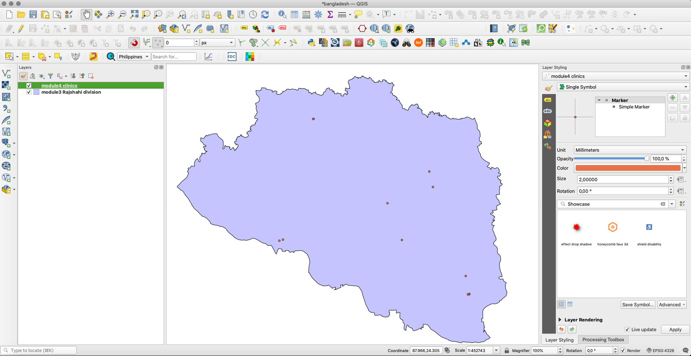

Figure 4.3: Default render

4. Double click the polygon vector layer, which is also the administrative boundary layer of Rajshahi division in Bangladesh
5. Select the **Symbology Tab** in the menu that appears
6. Change the **Fill color** to **Transparent fill. Tip:** Click the drop down arrow under Fill color
7. The result should be as below. You may notice that the no fill option has no color

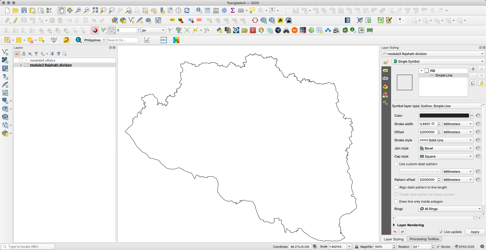

Figure 4.4: No fill rendering for the polygon

8. The next step is to symbolize the point layer which is also the Clinics layer
9. Double click the **Clinics layer** to open the **Layer Properties** dialogue. Change the render type from Single Symbol to **Categorized**, Select the **Value** as amenity. The value represents the field of interest. Specify the Symbol and Color ramp. Then Click classify.

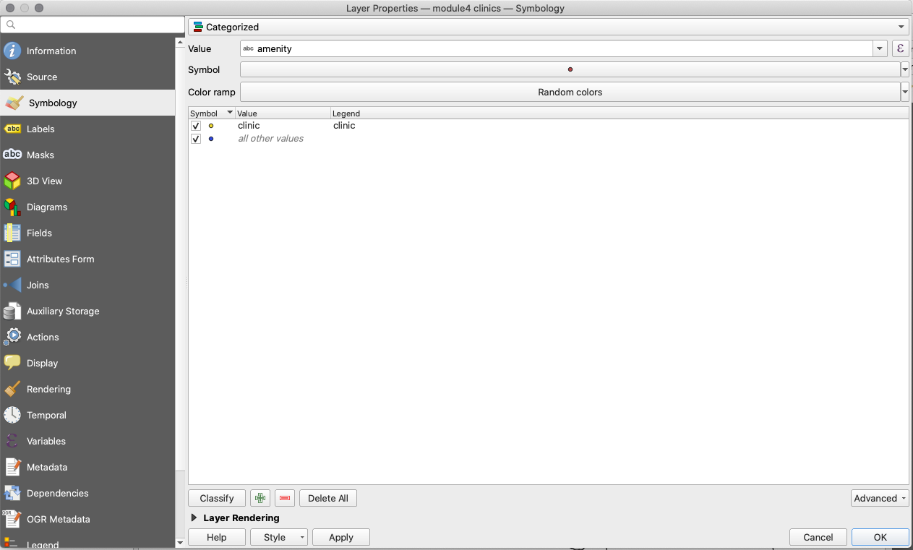

Figure 4.5: Layer Properties dialogue

10. The resulting map should look as below

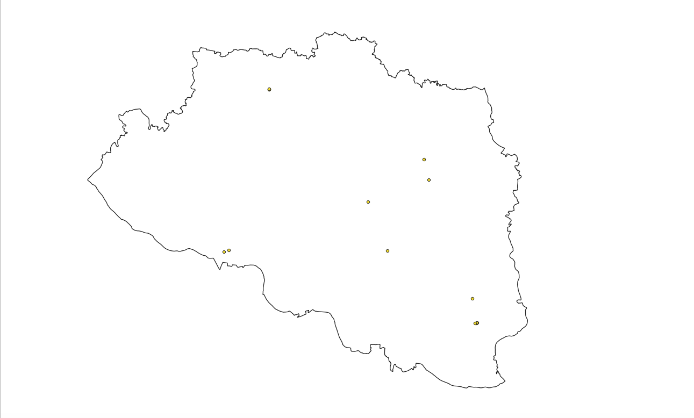

Figure 4.6: Final vector render

11.  Remember to arrange the layers in the **Layer Panel** in such a way that the polygon layer is below the point layer. This makes the point layer visible.

#### **Example 2: Raster rendering**

1. Double click the raster layer which is also the population density layer. This also means it’s a normalized dataset and can therefore be visualized as a choropleth map.
2. Select the symbology tab in the menu that appears
3. Change the styling mode to ‘Singleband pseudocolor’

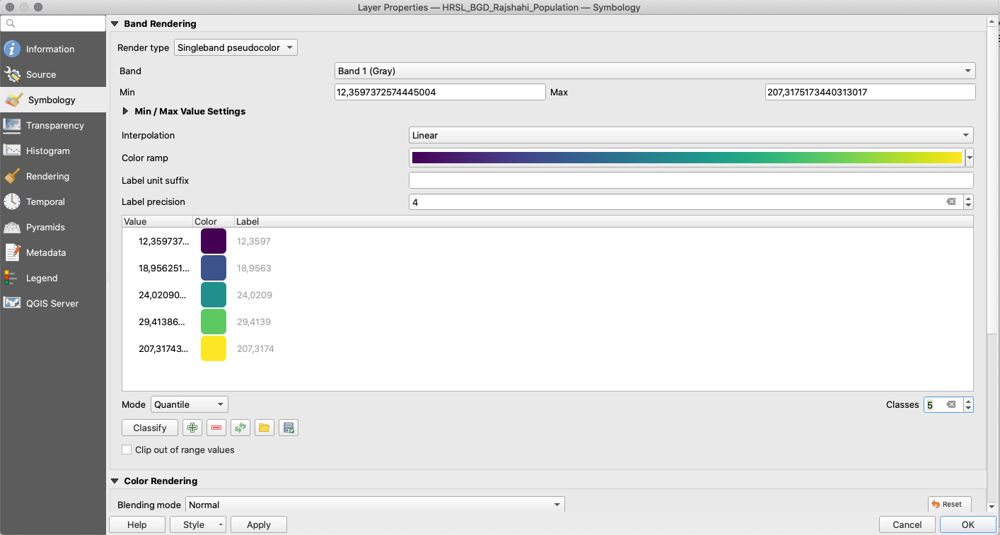

Figure 4.7: Symbology menu

4. Specify the interpolation, color ramp and mode. Click classify. The result is a choropleth map showing population density across Rajshahi division in Bangladesh.

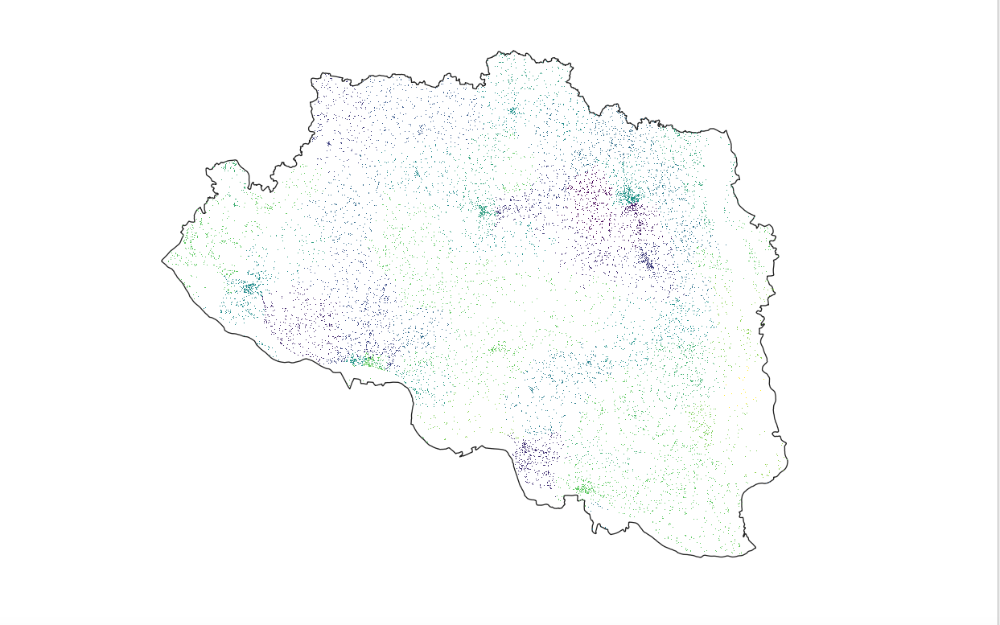

Figure 4.8: Population density of Rajshahi division, Bangladesh

5.  Zoom in to see the new map in finer detail.

Figure 4.9: Zoomed-in map

6. Alternatively, use the **Layer Styling panel**.

#### **Quiz questions**

1. What is layer symbology?
2. Which of the rendering types below are applicable for vector data?
3. What are the types of raster rendering

#### **Quiz answers**

1. a. graphical element represented as a marker, stroke or fill
   b. a pointer to the original data
   c. a repository of different color schemes

2. a. single symbol renderer
   b. no symbols renderer
   c. categorized renderer
   d. graduated renderer
   e. proportional symbol 
   f. proportional symbol
   g. point cluster renderer 

3. a. singleband pseudocolor
   b. singleband gray
   c. paletted

4. d. multiband color

### Phase 2: Blending modes and draw effects

#### **Content**

*   Altering symbol structures
*   Altering draw effects and blending modes
*   Impactful visualisation of data

#### **Tutorial**

1. After loading the two layers into QGIS, the canvas will look as below. You’ll notice that both layers have plain styling. This tutorial will explain how to alter draw effects and blending modes for better visualization.
   

Figure 4.10: The expected initial workspace

2. Open the Layer Properties window, then click the Symbology menu item for the administrative boundaries layer. Tip: Do this by double clicking the layer or use the layer styling panel. Enable the layer styling panel by clicking: View -> Panels -> Layer Styling. 

At the bottom of the Symbology menu, there’s a checkbox for Draw effects. Let’s enable that, and then click the customise effects button  to its right:

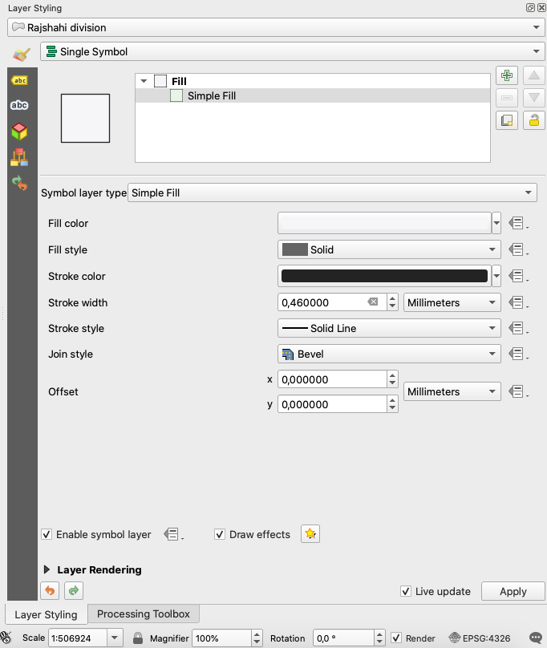

Figure 4.11: Layer Properties window and Symbology menu

3. A new Effects Properties dialog opens

Figure 4.12: Effects properties dialogue
   
4. You can see that currently the only effect listed is a Source effect. Source effects aren’t particularly exciting – all they do is draw the original layer unchanged. Change this to a Blur effect by **clicking the Effect type  combo box and selecting Blur**. You can then play around with the blur parameters.

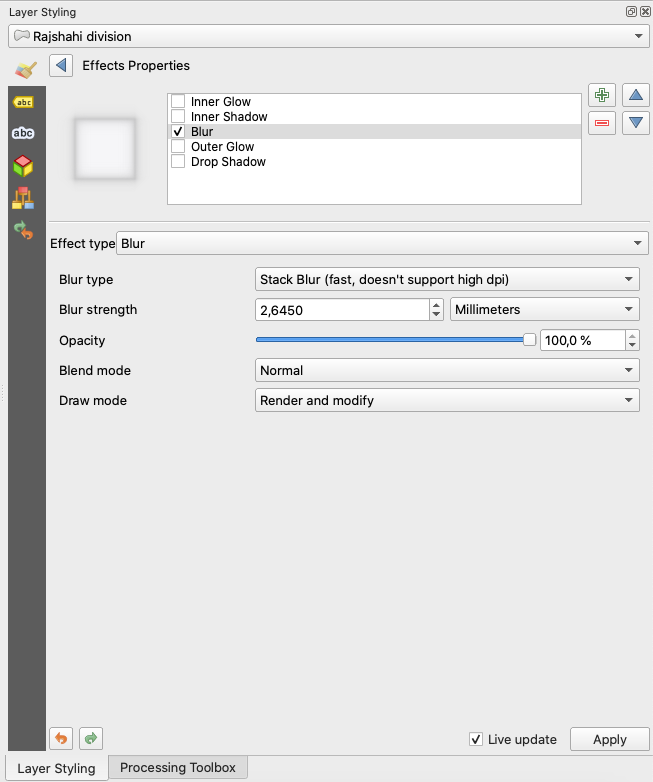

Figure 4.13: Select effect type as blur

5. Apply the settings now, you’ll see that the polygon layer is now blurry. Now we’re getting somewhere!	

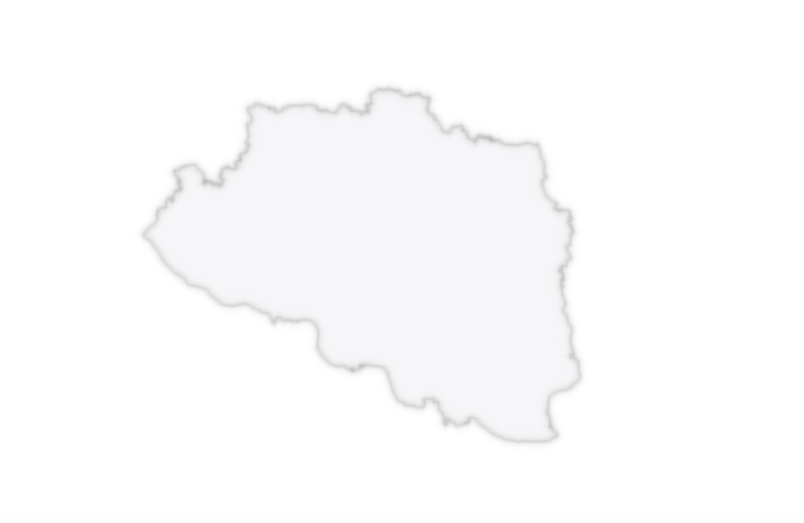

Figure 4.14: Blurry layer

6. Using the **Effects Properties** dialog again. Let’s try something a bit more advanced. Instead of just a single effect, it’s possible to chain multiple effects together to create different results. Let’s make a traditional drop shadow by adding a **Drop shadow** effect under the **Source** effect.

Figure 4.15: Effects properties dialogue

7. Effects are drawn top-down, so the drop shadow will appear below the source polygons

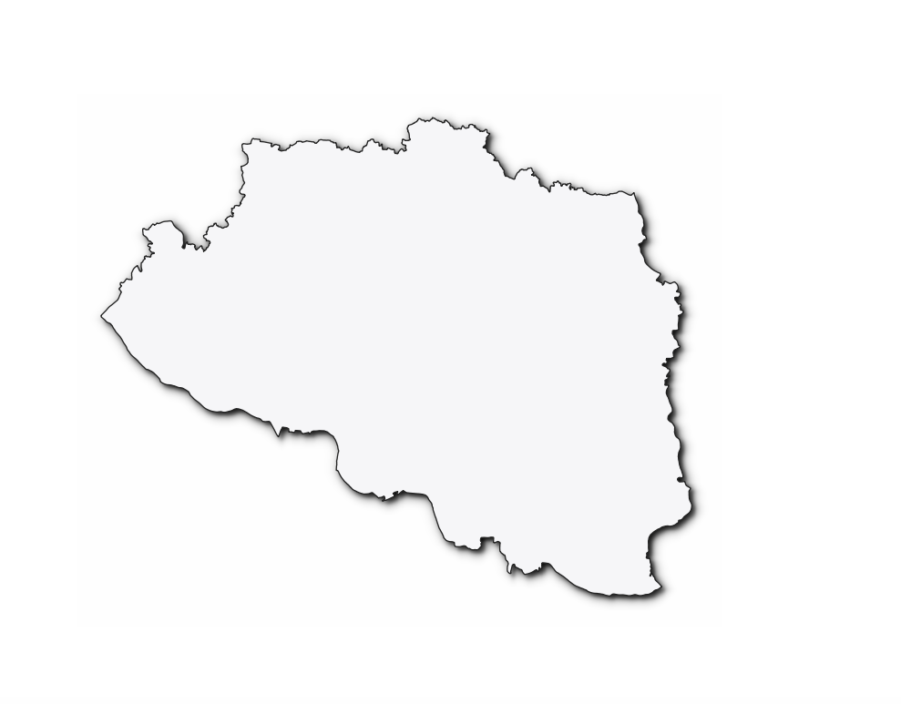

Figure 4.16: Drop shadow effect

8. You can stack as many effects as you like. For example an **inner glow** over a **source effect**, with a **drop shadow** below everything. Try it out!

Overall, remember that effects can either be applied to an entire layer, or to the individual symbol layers for features within a layer. Basically, the possibilities are almost endless! Python plugins can also extend this further by implementing additional effects.

For more examples about what you can do with Blending Modes and Draw Effects in QGIS, you can check out:
*   Hillshade in QGIS -[https://bnhr.xyz/2019/02/08/mapping-icebergs-in-qgis.html](https://bnhr.xyz/2019/02/08/mapping-icebergs-in-qgis.html)
*   Mapping Icebergs in QGIS - [https://bnhr.xyz/2019/02/08/mapping-icebergs-in-qgis.html](https://bnhr.xyz/2019/02/08/mapping-icebergs-in-qgis.html)

### Phase 3: Data defined overrides and geometry generators

#### **Content**

*   Run a spatial operation within the layer symbology

#### **Tutorial**

A geometry generator is a symbol layer type that lets you use code to create new geometries from existing features, and use the new 'generated' geometries as symbols that can, in turn, have styles applied. This is a powerful feature best explained with an example.

You can use the geometry generator symbology with all layer types (points, lines and polygons). The resulting symbol depends directly on the layer type.

Very briefly, the geometry generator symbology allows you to run some spatial operations within the symbology itself. For example you can run a real centroid spatial operation on a polygon layer without creating a point layer.

Moreover, you have all the styling options to change the appearance of the resulting symbol. Here’s an example tutorial;

1. Double click the administrative boundary layer
2. Click on Simple fill and change the Symbol layer type to Geometry generator. Before you start writing the spatial query, choose the Geometry Type in output. In this example we are going to create centroids for each feature, so change the Geometry Type to Point / Multipoint.

Figure 4.17: Centroid operation on administrative boundary layer

3. When you click on OK you will see that the administrative layer boundary is rendered as a point layer. We have just run a spatial operation within the layer symbology itself.

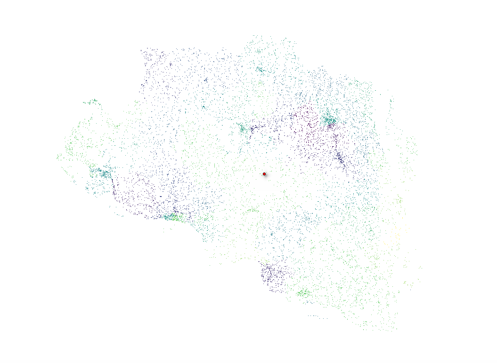

Figure 4.18: Point layer

4. Note that an alternative and easier way of writing spatial queries is using the ‘Expressions dialogue’. Click the 
 expressions  button to open the 'Expression string builder' dialogue box. Here you’ll have access to an extensive function reference. You can search for a function by name. For example, type centroid in the search bar.
5. With the Geometry generator symbology you can really go over the edge of normal symbology.
6. If you want to go further, write a spatial query to calculate a buffer zone around the point, line or polygon layer. 

#### **Quiz questions**

1.N/A

#### **Quiz answers**

1.N.A

   